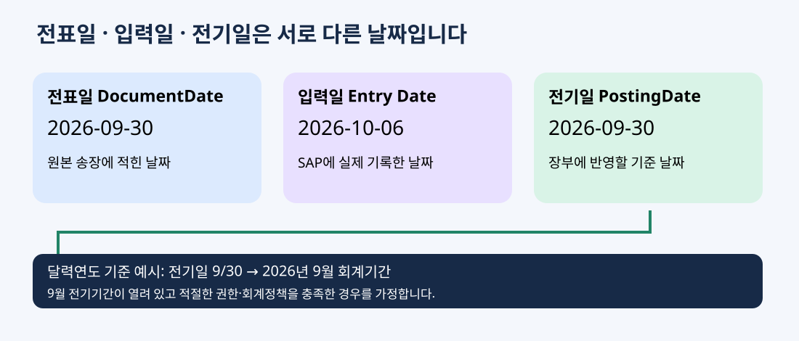

# 전표일·전기일: 날짜와 회계기간

**전표일은 원본 거래 문서의 날짜, 전기일은 장부에 반영할 회계 기준 날짜입니다. 실제 입력한 날짜와도 구분합니다.**



위 이미지는 학습용 도식이며 실제 SAP 화면이 아닙니다.

## 1. 날짜 비교

| 용어 | 의미 | 기술 이름 예시 |
|---|---|---|
| 전표일 (Document Date) | 원본 송장 등 거래 문서의 날짜 | BKPF-BLDAT / DocumentDate |
| 전기일 (Posting Date) | 어느 회계기간에 장부를 반영할지 결정하는 날짜 | BKPF-BUDAT / PostingDate |
| 입력일 (Entry Date) | SAP에 실제 전표를 기록한 날짜 | BKPF-CPUDT |
| 지급·입금일 | 실제 돈을 지급하거나 받은 날짜 | 해당 업무의 날짜. 위 날짜들과 항상 같지 않음 |

전표일은 항상 서비스 제공일·수익 인식일과 같다는 뜻이 아닙니다. 회계 인식은 실제 거래와 적용 기준에 따라 판단합니다.

## 2. 늦게 받은 송장 예시

- 원본 송장 날짜: 2026-09-30.
- 실제 입력 날짜: 2026-10-06.
- 회계 검토 후 전기일: 2026-09-30.
- 달력연도 회계이며 9월 기간이 열려 있고 권한이 있다고 가정.

전표일은 9/30, 입력일은 10/6, 전기일은 9/30입니다. 10월에 입력해도 장부상으로는 9월 회계기간에 반영됩니다.

반대로 적절한 회계 검토에 따라 전기일을 10/6으로 정한다면 10월에 반영됩니다. **9월 기간이 닫혔다는 이유만으로 임의로 10월에 비용을 넘겨도 된다는 뜻은 아닙니다.** 회사의 결산·조정 절차를 따릅니다.

## 3. 전기일이 중요한 이유

전기일과 회계연도 변형 등 관련 설정으로 회계연도·전기기간을 결정합니다. 회계연도가 달력연도와 다르면 날짜의 월 숫자와 전기기간이 다를 수 있습니다. 특별기간은 별도 규칙을 확인합니다.

SAP는 결정된 기간의 개방 여부와 관련 권한 등을 확인합니다. 기간이 닫혀 있으면 전기가 거절될 수 있습니다.

## 4. SAP GUI

전표 입력에서 Document Date와 Posting Date를 구분해 입력합니다. FB03 헤더에서도 날짜를 확인합니다.

- 원본 문서 근거 확인 → 전표일 입력.
- 회계 인식·결산 정책 확인 → 전기일 결정.
- 회사코드 및 전기기간 개방·권한 확인.
- 전표 입력·전기 후 날짜와 회계연도 확인.

지급조건의 기준일, 만기일, 세금 관련 날짜, 환산일 등은 별도 개념입니다. 모두 전기일과 동일하다고 가정하지 않습니다.

## 5. RAP 필드와 CDS

전표 헤더 관련 표준 CDS 예시로 I_JournalEntry를 시스템에서 확인할 수 있습니다. DocumentDate·PostingDate 등 필요한 필드의 실제 제공 여부와 공개 상태는 ADT·View Browser에서 확인합니다.

사용자 정의 요청 모델은 다음처럼 날짜를 분리합니다.

| 사용자 정의 필드 | 역할 |
|---|---|
| RequestUUID | 요청 식별 |
| CompanyCode | 처리 대상 회사 |
| DocumentDate | 원본 문서 날짜 |
| PostingDate | 회계 반영 날짜 |
| CreatedAt | 요청 생성 시각. FI 전표의 입력일과 다른 정보 |

가상 테이블을 사용하는 설명용 CDS 부분:

```abap
define root view entity ZI_FIDateRequest
  as select from zfi_req_h
{
  key request_uuid as RequestUUID,
      company_code as CompanyCode,
      document_date as DocumentDate,
      posting_date as PostingDate
}
```

날짜는 헤더에 속한 값이지 각각 독립된 부모·자식 객체가 아닙니다. **날짜 필드마다 Association을 만들 필요는 없습니다.** 회사코드 설정 참조에는 Association을 사용할 수 있습니다.

## 6. RAP 검증·API 전달

- 필수 날짜 입력과 날짜 유효성 확인.
- 선택 회사코드 및 관련 회계 설정으로 기간 확인.
- 실제 FI 전기 단계에서도 표준 검증 결과 처리.
- 요청 저장 후 전기까지 기간이 마감될 수 있으므로 재확인.
- 표준 API의 DocumentDate·PostingDate 의미를 확인하고 정확히 전달.
- DocumentDate가 항상 PostingDate보다 빠르다는 고정 규칙을 근거 없이 만들지 않음.
- 날짜를 사용자 모르게 오늘 날짜로 덮어쓰지 않음.

**요청 CreatedAt과 FI 전표 입력일은 별개**이며 요청을 저장했다고 FI 전표가 전기되는 것은 아닙니다.

## 공식 참고 자료

- [SAP 전기일과 전기기간 결정](https://help.sap.com/docs/SAP_S4HANA_ON-PREMISE/3cb1182b4a184bdd93f8d62e3f1f0741/1352d7531a4d424de10000000a174cb4.html)
- [SAP 회계연도](https://help.sap.com/docs/SAP_S4HANA_ON-PREMISE/e11afc9cd9e541e39f312d36cdc03ced/7353d7531a4d424de10000000a174cb4.html)
- [SAP 전기기간 통제](https://learning.sap.com/courses/customizing-financial-document-control/defining-posting-periods-in-financial-accounting)

[전표 헤더·항목](11-document-header-items.md) · [FI 학습 순서](02-fi-roadmap.md) · [용어집](05-fi-glossary.md)

정리일: 2026-10-06
